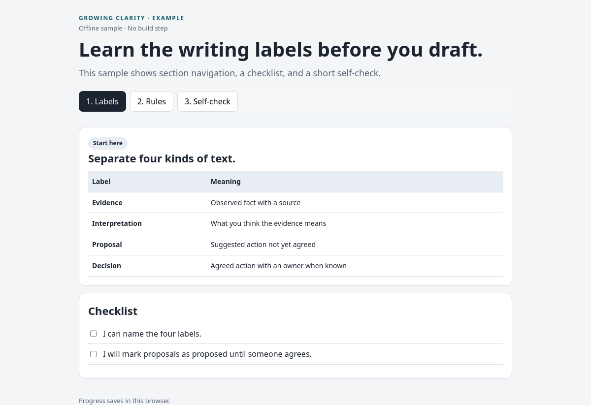

# Growing Clarity

Clear English standards and agent skills that help people write better docs — and help AI agents stay precise as they grow.

## Why this exists

Long, vague, hype-filled text confuses readers and models. Short, labeled, concrete English reduces mistakes for both.

Use this package to:

- write documentation that a tired non-native reader can trust
- teach agents to separate evidence, interpretation, proposals, and decisions
- build small offline interactive HTML guides without a framework
- give future model sessions a stable writing contract they can follow

## What you get

| Path | Purpose |
|---|---|
| [`docs/english-writing-standards.md`](docs/english-writing-standards.md) | Canonical English writing policy |
| [`skills/clean-english/`](skills/clean-english/) | Skill that applies the writing policy |
| [`skills/interactive-html/`](skills/interactive-html/) | Skill that builds accessible interactive HTML guides |
| [`examples/interactive-html/`](examples/interactive-html/) | Minimal sample guide |
| [`scripts/install.sh`](scripts/install.sh) | Copy skills into another project |

## Writing standards in one line

Active voice, consistent terms, short sentences, clear evidence labels, and no hype.

The full policy combines:

- Google Developer Documentation Style Guide
- ASD-STE100-derived precision
- Zinsser's clarity, simplicity, brevity, and humanity

These are derived rules. They are not a claim of certified ASD-STE100 compliance.

## Install

### Option A — copy into a project

```bash
git clone https://github.com/alimoradi296/growing-clarity.git
cd growing-clarity
./scripts/install.sh /path/to/your-project
```

The script copies skills into:

- `your-project/.agents/skills/`
- `your-project/.cursor/skills/` as symlinks when that folder exists or can be created

Then add this block to the project `AGENTS.md` or equivalent agent instructions:

```md
## English writing standards

Follow `docs/english-writing-standards.md` from Growing Clarity.
Skills must refer to that document instead of copying it.
```

### Option B — manual copy

1. Copy `docs/english-writing-standards.md` into your docs tree.
2. Copy `skills/clean-english` and `skills/interactive-html` into `.agents/skills/`.
3. For Cursor, symlink them under `.cursor/skills/`.
4. Point project agent instructions at the standards document.

### Option C — use as a reference repo

Keep this repository nearby. Tell your agent:

```text
Use growing-clarity/docs/english-writing-standards.md
and the skills under growing-clarity/skills/.
```

## Quick start for agents

### Rewrite text

```text
/clean-english
Rewrite this README for a tired non-native reader.
```

### Build a learning page

```text
/interactive-html
Create docs/interactive-learning/topic-guide.html that teaches X.
```

## Example

Open the sample guide in a browser:

```bash
xdg-open examples/interactive-html/sample-learning-guide.html
```



The screenshot shows the default Labels section with navigation, a comparison table, and a checklist.

## Design choices

- Skills stay short and link to one writing policy.
- HTML guides stay self-contained so they work offline.
- Evidence, interpretation, proposals, and decisions stay labeled.
- The package stays product-agnostic. Examples contain no private personal or codebase data.
- Clear writing is treated as a learning aid for humans and agents.

## Privacy

This repository must not contain:

- personal contact details or private biography
- employer or customer names from private work
- proprietary source paths, internal ticket IDs, or production credentials

If you contribute, keep examples generic.

## Contributing

See [CONTRIBUTING.md](CONTRIBUTING.md).

## License

[MIT](LICENSE)
